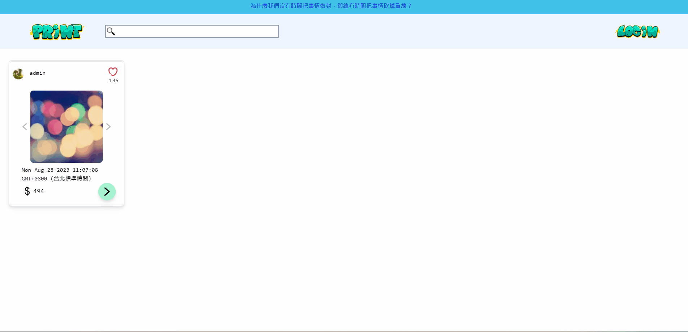

# Demo 3D列印商店\_網頁專案 (Angular)

此為測試版, 主要為展示查詢, 新增,刪除, 多項產品的功能

Web: http://frankyya.com:36010/

後端在: [print-3d-backend](https://github.com/franky3020/DogeStore)

[舊版本連結](https://github.com/franky3020/doge_store_front)

## 環境

1. Node 版本: 18.16.0

## 部暑方法

1. docker build -t franky_print_3d_web .
2. docker rm -f franky_print_3d_web || true
3. docker run -d -p 36010:80 --name franky_print_3d_web franky_print_3d_web
